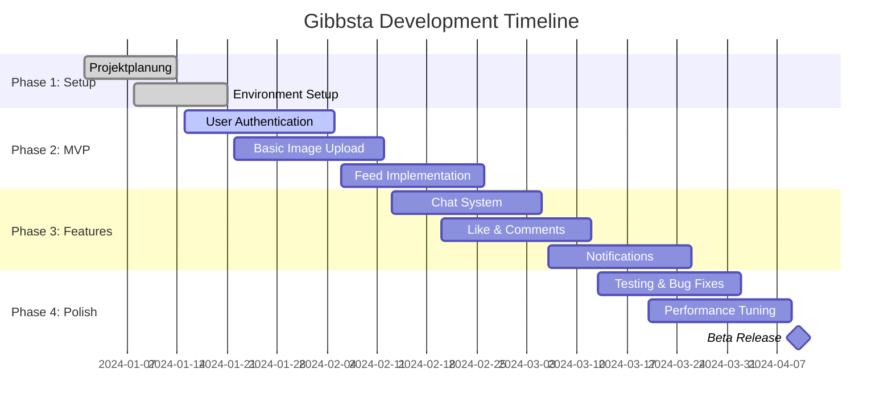

# 📱 Gibbsta - Social Media App für die GIBB

> Eine Instagram-ähnliche App speziell für Schüler der GIBB Berufsfachschule

[](https://github.com/gibb-team/gibbsta)
[](https://github.com/gibb-team/gibbsta/releases)
[](LICENSE)

---

## 🎯 Projektziel

Eine benutzerfreundliche Social Media Plattform, die speziell für die GIBB-Schulgemeinschaft entwickelt wird. Schüler können Bilder teilen, sich vernetzen und schulbezogene Inhalte austauschen.

### ✨ Hauptfeatures
- 📸 **Bilder hochladen** und mit der Community teilen
- 💬 **Chat-System** für 1-zu-1 und Gruppennachrichten  
- ❤️ **Like & Kommentar-System** für Interaktion
- 👥 **Schulspezifische Profile** mit Klassen- und Fachzuordnung
- 🔔 **Push-Benachrichtigungen** für wichtige Updates

---

## 🛠️ Tech Stack

<table>
<tr>
<td><strong>Frontend</strong></td>
<td>
  
  
  
</td>
</tr>
<tr>
<td><strong>Backend</strong></td>
<td>
  
  
</td>
</tr>
<tr>
<td><strong>Database</strong></td>
<td>
  
  
</td>
</tr>
<tr>
<td><strong>Tools</strong></td>
<td>
  
  
  
</td>
</tr>
</table>

---

## 👥 Team & Rollen

<table>
<tr>
<th>👨‍💻 Frontend Team</th>
<th>⚙️ Backend Team</th>
<th>🎨 Design Team</th>
<th>🚀 DevOps</th>
</tr>
<tr>
<td>
• UI/UX Implementierung<br>
• Mobile App Development<br>
• User Experience<br>
• Component-Architektur
</td>
<td>
• API Development<br>
• Datenbankdesign<br>
• Authentication<br>
• Server-Logic
</td>
<td>
• Mockups & Prototyping<br>
• Design System<br>
• User Research<br>
• Brand Identity
</td>
<td>
• App Deployment<br>
• Testing Koordination<br>
• Performance Monitoring<br>
• Project Management
</td>
</tr>
</table>

---

## 🗓️ Roadmap



---

## 📋 Feature Backlog

### 🔥 MVP (Version 1.0)
- [x] User Registration & Login
- [x] Basic Profile Creation
- [ ] Image Upload Functionality
- [ ] Feed Display
- [ ] Basic Like System
- [ ] Simple Chat

### 🚀 Version 1.1
- [ ] Comment System
- [ ] Group Chats
- [ ] Push Notifications
- [ ] Profile Customization
- [ ] Search Functionality

### 🌟 Version 1.2
- [ ] Stories Feature
- [ ] Image Filters
- [ ] Event Calendar
- [ ] Class-specific Groups
- [ ] Dark Mode

### 🎯 Future Ideas
- [ ] Video Upload
- [ ] Voice Messages
- [ ] Study Groups
- [ ] Homework Sharing
- [ ] Teacher Integration

---

## 🏗️ Projektstruktur

```
gibbsta/
├── 📱 frontend/
│   ├── src/
│   │   ├── components/
│   │   ├── screens/
│   │   ├── utils/
│   │   └── assets/
│   └── package.json
├── ⚙️ backend/
│   ├── routes/
│   ├── models/
│   ├── middleware/
│   └── server.js
├── 🎨 design/
│   ├── mockups/
│   ├── assets/
│   └── style-guide.md
├── 📚 docs/
│   ├── api-documentation.md
│   ├── user-guide.md
│   └── deployment.md
└── 🧪 tests/
    ├── unit/
    ├── integration/
    └── e2e/
```

---

## 🚀 Quick Start

### Voraussetzungen
- Node.js (v16+)
- React Native CLI
- Git
- Firebase Account

### Installation

```bash
# Repository klonen
git clone https://github.com/gibb-team/gibbsta.git
cd gibbsta

# Dependencies installieren
npm install

# Environment Setup
cp .env.example .env
# Firebase Konfiguration in .env eintragen

# Development Server starten
npm run dev
```

### 📱 Mobile App starten
```bash
# iOS
npx react-native run-ios

# Android
npx react-native run-android
```

---

## 📊 Entwicklungsmetriken

<div align="center">

| Metric | Ziel | Status |
|--------|------|--------|
| **Code Coverage** | >80% |  |
| **Performance** | <2s Load |  |
| **Bundle Size** | <5MB |  |
| **User Rating** | >4.5⭐ |  |

</div>

---

## 🔐 Sicherheit & Datenschutz

### 🛡️ Sicherheitsmaßnahmen
- ✅ **End-zu-End Verschlüsselung** für Chat-Nachrichten
- ✅ **DSGVO-konforme** Datenverarbeitung
- ✅ **Sichere Authentication** mit JWT Tokens
- ✅ **Input Validation** auf allen Ebenen
- ✅ **Content Moderation** System

### 📋 Compliance
- 🇪🇺 **DSGVO/GDPR** konform
- 🇨🇭 **Schweizer Datenschutzgesetz** konform
- 🔒 **ISO 27001** Security Standards

---

## 📚 Lernressourcen

### 🎓 Für Anfänger
- [React Native Tutorial](https://reactnative.dev/docs/tutorial) - Offizielle Dokumentation
- [Firebase Crashkurs](https://www.youtube.com/watch?v=9kRgVxULbag) - YouTube Tutorial
- [Git Basics](https://git-scm.com/book/en/v2) - Versionskontrolle lernen

### 🔧 Für Fortgeschrittene
- [Advanced React Patterns](https://kentcdodds.com/blog/advanced-react-patterns) - Kent C. Dodds
- [Node.js Best Practices](https://github.com/goldbergyoni/nodebestpractices) - GitHub Repo
- [Mobile App Security](https://owasp.org/www-project-mobile-app-security/) - OWASP Guide

---

## 🤝 Contributing

Wir freuen uns über Beiträge! Bitte lies unsere [Contributing Guidelines](CONTRIBUTING.md) vor deinem ersten Pull Request.

### 📝 Pull Request Process
1. Fork das Repository
2. Erstelle einen Feature Branch (`git checkout -b feature/amazing-feature`)
3. Committe deine Änderungen (`git commit -m 'Add amazing feature'`)
4. Push zum Branch (`git push origin feature/amazing-feature`)
5. Öffne einen Pull Request

---

## 📞 Support & Kontakt

<div align="center">

**📧 Email:** gibbsta-team@students.gibb.ch  
**💬 Discord:** [Gibb Community Server](https://discord.gg/gibbsta)  
**🐛 Bug Reports:** [GitHub Issues](https://github.com/gibb-team/gibbsta/issues)

---

**Entwickelt mit ❤️ von GIBB Studenten für GIBB Studenten**


</div>
